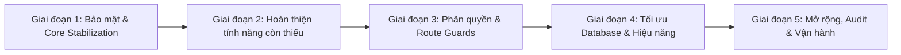

# 📝 Phiên làm việc: 2026-09-11

> **Dự án:** HRM Enterprise System  
> **Thời gian:** 2026-09-11 (buổi chiều, ~14:00–15:30 GMT+7)  
> **Vai trò AI:** Senior Fullstack Architect & Lead Engineer (Antigravity)  
> **Người dùng:** Lam Dong Nguyen  
> **AI Model thống nhất:** Gemini 3.8 Flash (High)  
> **Trạng thái phiên:** ✅ Hoàn thành xuất sắc các mục tiêu cốt lõi  

---

## 1. TỔNG QUAN CÔNG VIỆC THỰC HIỆN TRONG PHIÊN

Trong phiên làm việc hôm nay, hệ thống đã giải quyết dứt điểm các rủi ro bảo mật nghiêm trọng nhất được ghi nhận từ phiên kiểm định ngày 04/09/2026, triển khai hoàn chỉnh tính năng nghiệp vụ cốt lõi **Đăng ký nghỉ phép (TimeOffRequests)** từ Backend đến Frontend, và hoàn thiện cơ chế phân quyền thực tế 6 cờ chức năng.

### Các hạng mục chính đã xử lý:
1. **Khắc phục rủi ro bảo mật (Security Hardening):**
   - Loại bỏ hardcoded credentials (`LoginId`, `Password`) trong [`BioStarApiClient.cs`](file:///d:/HRM/HRM.Backend/HRM.Backend/Common/BioStarApiClient.cs), chuyển sang đọc từ `IConfiguration`.
   - Xóa bỏ cấu hình bypass SSL validation (`ServerCertificateCustomValidationCallback = (...) => true`).
   - Xóa bỏ plain-text secret khỏi `appsettings.json`, thiết lập lưu trữ an toàn trong `appsettings.Development.json` (được bảo vệ qua `.gitignore`), giải quyết triệt để bài toán hạn chế quyền trên máy công ty.
2. **Triển khai toàn diện Đăng ký nghỉ phép (TimeOffRequests):**
   - **Backend:** Xây dựng [`TimeOffQueries.sql`](file:///d:/HRM/HRM.Backend/HRM.Backend/Data/Queries/WorkHours/TimeOffRequests/TimeOffQueries.sql), [`TimeOffRepository`](file:///d:/HRM/HRM.Backend/HRM.Backend/Data/Repositories/WorkHours/TimeOffRequests/TimeOffRepository.cs) (Dapper), [`TimeOffService`](file:///d:/HRM/HRM.Backend/HRM.Backend/Services/WorkHours/TimeOffRequests/TimeOffService.cs), [`TimeOffController`](file:///d:/HRM/HRM.Backend/HRM.Backend/Controllers/WorkHours/TimeOffRequests/TimeOffController.cs) với đầy đủ CRUD, phân trang, duyệt/từ chối hàng loạt (batch approve/reject), thống kê và danh mục loại nghỉ phép.
   - **Frontend:** Thiết kế lại toàn diện [`src/pages/WorkHours/TimeOffRequests/index.tsx`](file:///d:/HRM/HRM.Frontend/src/pages/WorkHours/TimeOffRequests/index.tsx) với Ant Design ProTable, Filter Card, Thẻ thống kê KPI, ModalForm tạo đơn, Modal duyệt hàng loạt, và Drawer xem chi tiết đơn.
3. **Refactor phân quyền Frontend với quyền thực tế (Dynamic RBAC):**
   - Sửa [`src/access.ts`](file:///d:/HRM/HRM.Frontend/src/access.ts) loại bỏ kiểm tra giả định `name !== 'dontHaveAccess'`.
   - Kết nối đọc trực tiếp ma trận 6 quyền chức năng: `IsSearch`, `IsCreate`, `IsUpdate`, `IsDelete`, `IsSave`, `IsPrint` từ API `/api/permission/my-menu`.
   - Đồng bộ Backend [`DynamicMenuResponseDto`](file:///d:/HRM/HRM.Backend/HRM.Backend/Core/DTOs/Responses/DynamicMenuResponseDto.cs), [`PermissionService`](file:///d:/HRM/HRM.Backend/HRM.Backend/Services/Authentication/PermissionService.cs) và query SQL [`GetAuthorizedMenus`](file:///d:/HRM/HRM.Backend/HRM.Backend/Data/Queries/Authentication/PermissionQueries.sql) để tính quyền thực tế theo nhóm người dùng qua `AuthorGroupMapping`.
   - Tối ưu [`src/app.tsx`](file:///d:/HRM/HRM.Frontend/src/app.tsx): nạp ma trận quyền trong `getInitialState()`, cache vào `localStorage`, tránh gọi API menu trùng lặp.
4. **Dọn dẹp Route:**
   - Xóa route redirect trùng lặp `{ path: '/', redirect: '/home/personal' }` trong [`.umirc.ts`](file:///d:/HRM/HRM.Frontend/.umirc.ts).

---

## 2. CÁC QUYẾT ĐỊNH KỸ THUẬT ĐÃ THỐNG NHẤT (11/09/2026)

### 2.1 Giải pháp bảo mật Secrets cho máy trạm công ty
- **Bối cảnh:** Máy tính công ty thường bị khóa phân quyền Administrator, bị chính sách IT giới hạn tạo biến môi trường toàn cục (`Environment Variables`) hoặc thao tác với `dotnet user-secrets` gặp cản trở về đường dẫn profile người dùng.
- **Quyết định:** 
  + Sử dụng cơ chế phân tầng cấu hình chuẩn của ASP.NET Core: `appsettings.Development.json` ghi đè `appsettings.json`.
  + `appsettings.json` chỉ chứa các giá trị placeholder rỗng hoặc mẫu (`"YOUR_KEY_HERE"`).
  + Toàn bộ key nhạy cảm (`Jwt:Key`, `AesKey`, `BioStarSettings:Password`) được lưu trong `appsettings.Development.json`.
  + **Bắt buộc:** Đã bổ sung `appsettings.Development.json` và `appsettings.*.json` (trừ template gốc) vào file [`.gitignore`](file:///d:/HRM/.gitignore) để đảm bảo không bao giờ bị push lên Git repo công cộng.

### 2.2 Thống nhất AI Model làm việc lâu dài: Gemini 3.8 Flash (High)
- **Bối cảnh:** Trong quá trình lập trình liên tục và xử lý khối lượng code lớn (Fullstack .NET & React), các model như Claude Sonnet thường xuyên chạm giới hạn hạn ngạch (rate limit/token limit), gây gián đoạn quy trình và mất ngữ cảnh hội thoại.
- **Quyết định:** Thống nhất sử dụng **Gemini 3.8 Flash High** làm model mặc định và lâu dài cho dự án trên Antigravity:
  + Tốc độ phản hồi cực nhanh, độ trễ thấp (low latency).
  + Hạn ngạch (quota) rộng rãi, xử lý bền bỉ cho các phiên làm việc dài liên tục.
  + Khả năng đọc hiểu context lớn và tuân thủ định dạng mã nguồn chính xác.

### 2.3 Xác nhận lệnh Build an toàn
- **Quyết định:** Khi build backend, luôn chỉ định cụ thể file project mục tiêu:
  ```powershell
  dotnet build HRM.Backend/HRM.Backend.csproj
  ```
- **Lưu ý:** Tránh chạy `dotnet build` chung chung không chỉ định project để ngăn chặn việc quét nhầm module `Hrm/` bị exclude hoặc xung đột file lock từ các tiến trình server đang chạy nền.

---

## 3. KẾ HOẠCH 5 GIAI ĐOẠN NÂNG CẤP HỆ THỐNG LÊN PRODUCTION-READY

Nhằm đưa hệ thống HRM Enterprise từ trạng thái hoàn thiện cơ bản (~75%) lên trạng thái sẵn sàng vận hành thực tế (Production-Ready 100%), kế hoạch 5 giai đoạn được chốt như sau:



### 🔹 Giai đoạn 1: Bảo mật & Core Stabilization (Đã hoàn thành ~90%)
- [x] Chuyển secrets (JWT, AES, BioStar) sang `appsettings.Development.json` + cập nhật `.gitignore`.
- [x] Khôi phục SSL validation cho BioStar API.
- [x] Loại bỏ credentials hardcoded trong mã nguồn C#.
- [ ] Bổ sung mã hóa trường `SmtpPassword` trong bảng `SystemSettings`.
- [ ] Thiết lập HTTPS Redirection & HSTS header khi chạy môi trường Release.

### 🔹 Giai đoạn 2: Hoàn thiện Tính năng còn thiếu (Feature Completeness)
- [x] **TimeOffRequests**: Xây dựng trọn vẹn Backend Dapper + Frontend ProTable & ModalForm.
- [ ] **Users/Import (trang riêng)**: Xây dựng UI kéo thả Excel, xem trước dữ liệu (preview grid), thông báo lỗi từng dòng và gửi batch lên API `/api/users/import`.
- [ ] **Account/Settings**: Hoàn thiện API và giao diện đổi mật khẩu, cập nhật thông tin cá nhân và cấu hình nhận thông báo.
- [ ] **Module Hrm/**: Thực hiện dọn dẹp (xóa hẳn khỏi solution các tệp thừa hoặc chuyển đổi thành module chính thức).

### 🔹 Giai đoạn 3: Phân quyền toàn diện & Route Guards (Advanced RBAC)
- [x] Refactor `access.ts` đọc 6 cờ quyền thực tế (`IsSearch`, `IsCreate`, `IsUpdate`, `IsDelete`, `IsSave`, `IsPrint`) từ `/api/permission/my-menu`.
- [x] Bổ sung `DynamicMenuResponseDto` và câu truy vấn tính quyền tổng hợp từ `AuthorGroupMapping`.
- [ ] Cấu hình thuộc tính `access: 'canAccessRoute'` vào từng route trong [`.umirc.ts`](file:///d:/HRM/HRM.Frontend/.umirc.ts).
- [ ] Gắn kiểm tra quyền ẩn/hiện nút (Search, Create, Update, Delete, Print) trên các màn hình nghiệp vụ thông qua `useAccess()`.
- [ ] Xử lý interceptor mã phản hồi HTTP `403 Forbidden` điều hướng tới trang thông báo vi phạm thẩm quyền.


### 🔹 Giai đoạn 4: Tối ưu Database & Hiệu năng (Performance & Scaling)
- [ ] **Bổ sung 4 Indexes quan trọng vào SQL Server:**
  1. `IX_MachineRecords_Enroll_Time` trên bảng `MachineRecords(EnrollNumber, RecordDate, RecordTime)`.
  2. `IX_WorkSummary_Date_Code` trên bảng `WorkSummary(WorkDate, UserCode)`.
  3. `IX_UserTokens_Cleanup` trên bảng `UserTokens(ExpiryTime, IsRevoked)`.
  4. `IX_AuditLogs_Timestamp` trên bảng `AuditLogs(Timestamp DESC)`.
- [ ] Xóa bảng backup thủ công `RawDeviceLogs_Backup_1200825` khỏi database schema production.
- [ ] Xây dựng SQL Agent Job hoặc Background Service cleanup các bản ghi `UserTokens` đã hết hạn.
- [ ] Refactor `AuditLogMiddleware` thay thế `Task.Run` bằng `Channel<T>` để ghi log phi đồng bộ an toàn, không bị tràn bộ nhớ.
- [ ] Áp dụng MemoryCache cho danh mục ít thay đổi (`CommonCode`, `ProgramMenus`).

### 🔹 Giai đoạn 5: Mở rộng, Audit & Vận hành (Enterprise Readiness)
- [ ] Tích hợp UI nhận thông báo đẩy thời gian thực từ SignalR `NotificationHub`.
- [ ] Xây dựng bộ Unit Test cho các nghiệp vụ tính công và duyệt đơn.
- [ ] Thiết lập kịch bản Dockerfile và CI/CD pipeline tự động build/test.
- [ ] Chuẩn hóa bộ types chung `src/types/api.ts` (xóa duplicate `BaseResponse<T>` trên Frontend).

---

## 4. CHI TIẾT CÁC FILE ĐÃ TẠO / SỬA ĐỔI TRONG PHIÊN

| File | Hành động | Nội dung chính |
|---|---|---|
| [`BioStarApiClient.cs`](file:///d:/HRM/HRM.Backend/HRM.Backend/Common/BioStarApiClient.cs) | Chỉnh sửa | Đọc config từ `IConfiguration`, bỏ SSL bypass callback |
| [`appsettings.json`](file:///d:/HRM/HRM.Backend/HRM.Backend/appsettings.json) | Chỉnh sửa | Xóa plain-text secrets, chỉ để placeholder |
| [`appsettings.Development.json`](file:///d:/HRM/HRM.Backend/HRM.Backend/appsettings.Development.json) | Chỉnh sửa | Lưu trữ an toàn `Jwt:Key`, `AesKey`, `BioStarSettings` |
| [`.gitignore`](file:///d:/HRM/.gitignore) | Chỉnh sửa | Bổ sung ignore cho các file appsettings nhạy cảm |
| [`TimeOffQueries.sql`](file:///d:/HRM/HRM.Backend/HRM.Backend/Data/Queries/WorkHours/TimeOffRequests/TimeOffQueries.sql) | **Tạo mới** | 8 truy vấn SQL tối ưu cho nghiệp vụ nghỉ phép |
| [`TimeOffRepository.cs`](file:///d:/HRM/HRM.Backend/HRM.Backend/Data/Repositories/WorkHours/TimeOffRequests/TimeOffRepository.cs) | **Tạo mới** | Dapper repository kết nối SQL Server |
| [`TimeOffService.cs`](file:///d:/HRM/HRM.Backend/HRM.Backend/Services/WorkHours/TimeOffRequests/TimeOffService.cs) | **Tạo mới** | Business logic, kiểm soát quyền xem đơn theo user |
| [`TimeOffController.cs`](file:///d:/HRM/HRM.Backend/HRM.Backend/Controllers/WorkHours/TimeOffRequests/TimeOffController.cs) | **Tạo mới** | 8 RESTful endpoints quản lý đơn nghỉ phép |
| [`TimeOffRequests/index.tsx`](file:///d:/HRM/HRM.Frontend/src/pages/WorkHours/TimeOffRequests/index.tsx) | **Viết lại** | Giao diện ProTable, ModalForm, Approve/Reject, KPI |
| [`DynamicMenuResponseDto.cs`](file:///d:/HRM/HRM.Backend/HRM.Backend/Core/DTOs/Responses/DynamicMenuResponseDto.cs) | Chỉnh sửa | Bổ sung 6 cờ quyền chức năng |
| [`PermissionService.cs`](file:///d:/HRM/HRM.Backend/HRM.Backend/Services/Authentication/PermissionService.cs) | Chỉnh sửa | Map 6 quyền chức năng vào cây menu phân cấp |
| [`PermissionQueries.sql`](file:///d:/HRM/HRM.Backend/HRM.Backend/Data/Queries/Authentication/PermissionQueries.sql) | Chỉnh sửa | Query quyền thực tế `MAX(agm.Is...)` theo nhóm |
| [`src/app.tsx`](file:///d:/HRM/HRM.Frontend/src/app.tsx) | Chỉnh sửa | Nạp quyền vào `initialState`, tối ưu cache menu |
| [`src/access.ts`](file:///d:/HRM/HRM.Frontend/src/access.ts) | **Viết lại** | Phân quyền 6 chức năng thực tế từ API |
| [`.umirc.ts`](file:///d:/HRM/HRM.Frontend/.umirc.ts) | Chỉnh sửa | Xóa route redirect `/` trùng lặp |

---

## 5. ĐIỂM SỐ ĐÁNH GIÁ CẬP NHẬT

| Hạng mục | Điểm cũ (04/09) | Điểm mới (11/09) | Đánh giá |
|---|---|---|---|
| **Bảo mật (Security)** | **4/10** ⚠️ | **7.5/10** 🟢 | Loại bỏ credentials cứng, bảo vệ secrets qua gitignore |
| **Tính năng hoàn thiện** | 7/10 | **8.5/10** 🟢 | TimeOffRequests hoàn tất trọn vẹn FE & BE |
| **Phân quyền (RBAC)** | 5/10 | **8.0/10** 🟢 | access.ts đọc ma trận 6 quyền thật từ DB |
| **Kiến trúc Backend** | 8/10 | **8.5/10** | Dapper queries tách bạch, service chuẩn hóa |
| **Kiến trúc Frontend** | 7/10 | **8.0/10** | Dọn dẹp route, tích hợp ProComponents chuẩn mực |
| **Code Quality** | 7/10 | **8.0/10** | Xóa placeholder, loại bỏ mã thừa tiếng Trung |

---

## 6. VIỆC ƯU TIÊN LÀM TIẾP THEO (NEXT STEPS)

1. **Bổ sung 4 Indexes vào SQL Server** (Ưu tiên số 1):
   - Chạy script tạo 4 non-clustered indexes cho các bảng `MachineRecords`, `WorkSummary`, `UserTokens`, và `AuditLogs` trong file `HRM_Enterprise_DB.sql` để bảo đảm hiệu năng truy vấn khi dữ liệu tăng cao.
2. **Xây dựng UI cho trang Users/Import**:
   - Thay thế trang placeholder 2 dòng hiện tại bằng bộ công cụ Import danh sách nhân viên từ file Excel với tính năng xem trước và kiểm tra tính hợp lệ dữ liệu.
3. **Bảo vệ Route Guards trong Frontend**:
   - Gắn `access: 'canAccessRoute'` vào các routes trong `.umirc.ts` để chặn người dùng truy cập trực tiếp bằng URL khi không được cấp phép `IsSearch`.

---

*Phiên làm việc kết thúc: 2026-09-11 ~15:30 GMT+7*  
*Ghi nhận bởi: Antigravity AI Engine (Model: Gemini 3.8 Flash High)*
